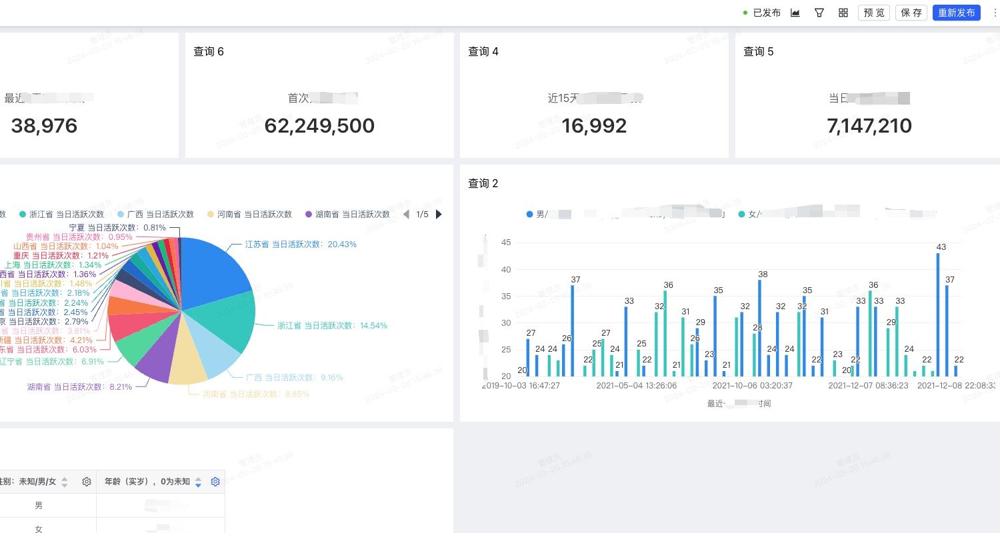

🌐 <a href="https://github.com/aopacloud/SuperBI/blob/master/README_zh.md" target="_blank">中文</a>

## Introduction

SuperBI is an interactive, efficient, flexible, and fast multi-dimensional visual analysis platform.

Key features include:

- **Self-service analysis** - Business personnel can freely drag and drop data for self-service analysis
- **Visualization reports** - Quickly build visual reports based on a rich variety of chart types and components
- **Second-level queries** - Supports second-level queries on massive data from various data sources
- **Zero barriers to entry** - Simple page interactions, allowing analysts to quickly get started
- **Data security** - Multi-level data permissions and operation controls for safer data analysis
- **Diverse data sources** - Supports multiple data sources for associated queries

[Official Website](https://superbi.aopacloud.net/),which contains detailed product documentation.

## Demo Images

<table>
    <tr>
        <td></td>
        <td></td>
    </tr>
    <tr>
        <td></td>
        <td></td>
    </tr>
    <tr>
        <td></td>
        <td></td>
    </tr>
	<tr>
        <td></td>
        <td></td>
    </tr>	 
</table>

## SuperBI Discussion Group


## Quick Start

The project offers a docker-compose deployment method, integrating MySQL and Redis, without the need for additional installations.

```shell
# Clone the repository
$ git clone https://github.com/aopacloud/SuperBI.git

# Enter the project directory
$ cd SuperBI

# Start with docker-compose
$ docker compose -f docker-compose.yml up -d
```
After the service has started, enter `http://127.0.0.1` in the browser to access.

Default username and password:  Admin/admin123

> The first startup requires database initialization, please wait patiently for 3-5 minutes.


## Source Code Compilation and Deployment

Before compiling from the source, ensure that `MySQL` and `Redis` are available.

### 1. Database Initialization

The project's database initialization file is provided in the `sql` directory and can be executed in `MySQL`.

```shell
mysql> source ${project_dir}/sql/init.sql
```

### 2. Backend Compilation

> Before compiling, modify the MySQL and Redis configuration in the ${project_dir}/backend/super-bi/src/main/resource/bootstrap.yml file.

```yaml
# MySQL configuration
datasource:
  master:
    driver-class-name: com.mysql.cj.jdbc.Driver
    url: jdbc:mysql://mysql:3306/bdp_super_bi?useUnicode=true&characterEncoding=utf8&zeroDateTimeBehavior=convertToNull&useSSL=true&serverTimezone=GMT%2B8
    username: root
    password: 123456
```

```yaml
# redis configuration
redis:
  host: redis
  port: 6379
  password:
```

The backend project uses `maven` for compilation. Before compiling, ensure `maven` is installed on the machine. 

```shell
$ cd backend
$ mvn clean package -DskipTest
```

After compilation, start the backend API server.

```shell
$ java -jar super-bi/target/super-bi.jar
```

### 3. Frontend Deployment

> The frontend project relies on the NODE environment, please ensure that NODE is correctly installed locally.

```shell

cd frontend

# Install dependencies
npm install

# Run
npm run dev

# Build
npm run build

# To build for different environments, run different build commands
npm run build:*
```

### 4. Compile Docker Image

After both frontend and backend projects have been successfully compiled, you can compile your own docker image.

```shell
# Enter the docker directory
$ cd docker

# Copy the compiled frontend files to the docker directory
$ cp -r ../frontend/dist-production ./super-bi

# Copy the compiled backend files to the docker directory
$ cp ../backend/super-bi/target/super-bi.jar .

$ docker build -t super-bi:test .
```

### 5. One-Click Compilation Script
The project provides a one-click compilation script `build.sh`, which can directly compile a docker image.

```shell
# Compile without docker image
$ sh build.sh

# Compile with docker image
$ sh build.sh docker
```