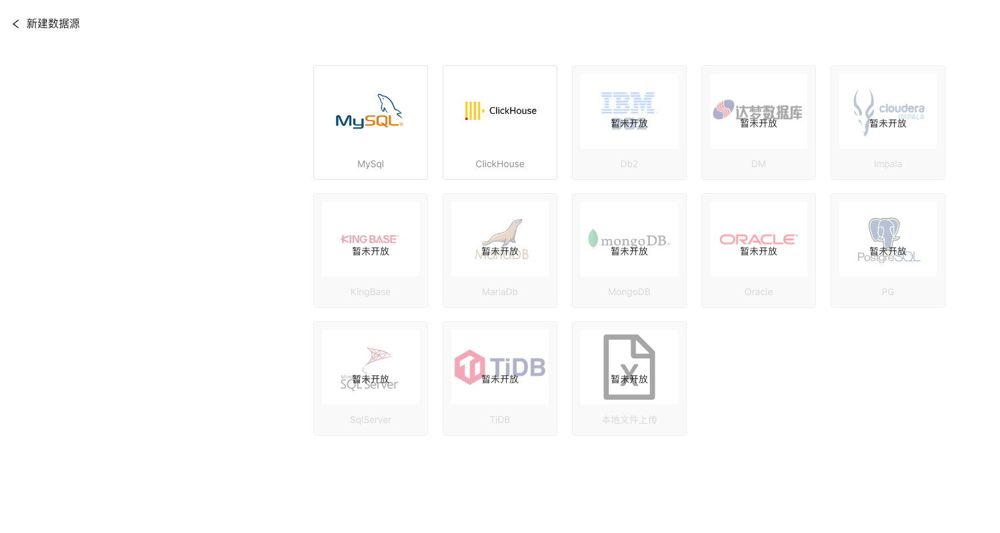
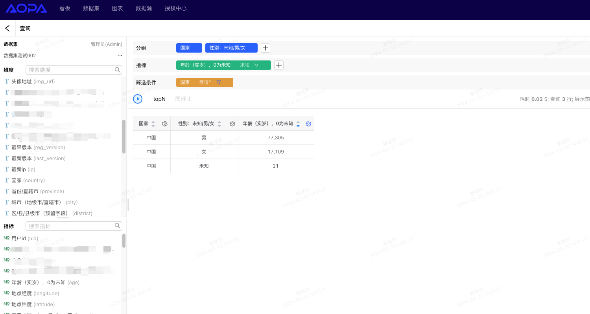
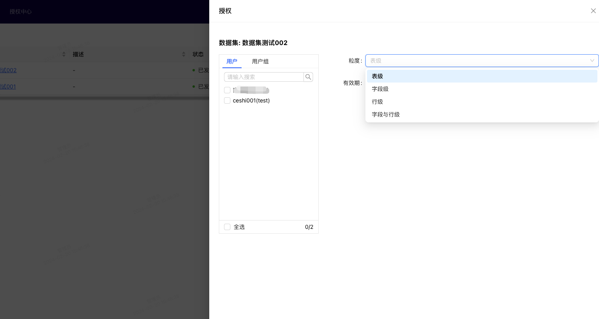

🌐 <a href="https://github.com/aopacloud/SuperBI/blob/master/README.md" target="_blank">English</a>

## 介绍

SuperBI 是一款交互简单、分析高效、操作灵活、查询快速的多维可视化分析平台。
核心功能点包括：

- 自助分析 - 业务人员自由拖拽数据自助分析
- 可视化报表 - 基于丰富的图表类型及组件快速搭建可视化报表
- 秒级查询 - 支持对海量数据多种数据源进行秒级查询
- 零门槛 - 页面交互简单，分析人员可快速上手使用
- 数据安全 - 多级数据权限及操作权限控制，数据分析更安全
- 数据源多样 - 支持多种数据源，实现不同数据源的关联查询

[官网地址](https://superbi.aopacloud.net/),里面有详细的产品文档。

## 演示图

<table>
    <tr>
        <td></td>
        <td></td>
    </tr>
    <tr>
        <td></td>
        <td></td>
    </tr>
    <tr>
        <td></td>
        <td></td>
    </tr>
	<tr>
        <td></td>
        <td></td>
    </tr>	 
</table>

## SuperBI 交流群


## 快速上手

项目提供了 docker compose 部署方式，集成了 MySQL, Redis , 无需额外安装。

```shell
# 拉取仓库
$ git clone https://github.com/aopacloud/SuperBI.git

# 进入项目目录
$ cd SuperBI

# docker-compose 启动
$ docker compose -f docker-compose.yml up -d
```
等待服务启动完成后，在浏览器中输入 `http://127.0.0.1` 即可访问

默认用户名密码： Admin/admin123

> 第一次启动需要初始化数据库，请耐心等待 3-5 分钟


## 源码编译部署

从源码编译安装之前确保有可用的`MySQL`,`Redis`

### 1. 数据库初始化

在`sql` 目录提供了项目的数据库初始化文件，在`MySQL`中执行即可

```shell
mysql> source ${project_dir}/sql/init.sql
```

### 2. 后端编译

> 编译之前修改 ${project_dir}/backend/super-bi/src/main/resource/bootstrap.yml 文件中的 MySQL, Redis 的配置

```yaml
# MySQL 配置
datasource:
  master:
    driver-class-name: com.mysql.cj.jdbc.Driver
    url: jdbc:mysql://mysql:3306/bdp_super_bi?useUnicode=true&characterEncoding=utf8&zeroDateTimeBehavior=convertToNull&useSSL=true&serverTimezone=GMT%2B8
    username: root
    password: 123456
```

```yaml
# redis 配置
redis:
  host: redis
  port: 6379
  password:
```

后端项目使用 `maven` 编译，编译之前确保机器上安装有 `maven`

```shell
$ cd backend
$ mvn clean package -DskipTest
```

编译完成后启动后端 api server

```shell
$ java -jar super-bi/target/super-bi.jar
```

### 3. 前端部署

> 前端项目依赖 NODE 环境，请确保本地 NODE 正确安装

```shell

cd frontend

# 安装依赖
npm install

# 运行
npm run dev

# 构建
npm run build

# 构建不同环境 运行不同biuld命令
npm run build:*
```

### 4. 编译 docker 镜像

在前后端项目都编译成功之后，即可编译自己的 docker 镜像

```shell
# 进入 docker 目录
$ cd docker

# copy 前端编译后的文件到 docker 目录
$ cp -r ../frontend/dist-production ./super-bi

# copy 后端编译后的文件到 docker 目录
$ cp ../backend/super-bi/target/super-bi.jar .

$ docker build -t super-bi:test .
```

### 5. 一键编译脚本
项目提供了一键编译脚本 `build.sh`，可以直接编译出 docker 镜像

```shell
# 不带 docker 镜像编译
$ sh build.sh

# 带 docker 镜像编译
$ sh build.sh docker
```